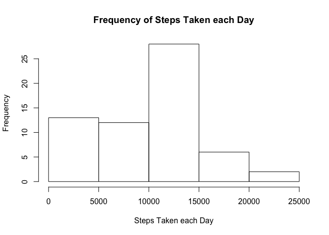
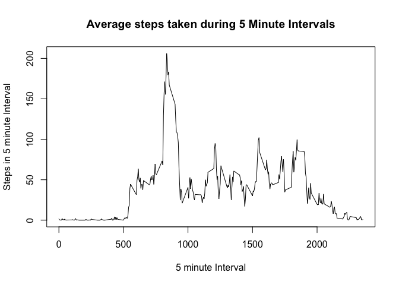
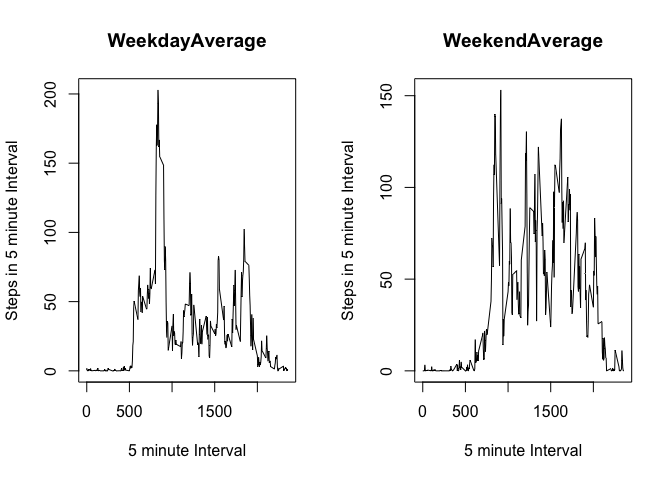

# RepResearchProject

###Load the Data

The below code loads the data and pre-processes the data. It also loads the dplyr package which will be used later.


```r
filename <- "~/data/RepResearch/activity.csv"
stepdata <- read.csv(filename,header = TRUE)
library(dplyr)
```

```
## 
## Attaching package: 'dplyr'
```

```
## The following objects are masked from 'package:stats':
## 
##     filter, lag
```

```
## The following objects are masked from 'package:base':
## 
##     intersect, setdiff, setequal, union
```

###Histogram of Total Steps by Day

The below code displays the histogram of total number of steps taken by day by using the tapply function to sum the number of steps by day and graph those sums as a histogram.


```r
#Build and plot the histogram of the step data
hist(x = tapply(stepdata$steps, stepdata$date, FUN = sum, na.rm = TRUE), xlab = "Steps Taken each Day", main = "Frequency of Steps Taken each Day")
```

<!-- -->

###Calculate the Mean and Median 


```r
#Calculate the mean and median of the step data
daymean <- mean(tapply(stepdata$steps, stepdata$date, FUN = sum, na.rm = TRUE), na.rm = TRUE)
daymedian <- median(tapply(stepdata$steps, stepdata$date, FUN = sum, na.rm = TRUE), na.rm = TRUE)
```

The mean day has **9354.2295082** steps.
The median day has **10395** steps.

###Time Series Plot

This code calculates the average daily activity pattern by creating a time series plot of the 5 minute intervals and the average number of steps taken across all days. 


```r
#Initialize the timeseries plot
timeseries <- aggregate(stepdata$steps ~ stepdata$interval, FUN = mean)

#plot the time series
plot(timeseries, type = "l", xlab = "5 minute Interval", ylab = "Steps in 5 minute Interval", main = "Average steps taken during 5 Minute Intervals")
```

<!-- -->

### Top Interval

The below code calculates and lists the 5 minute interval that on average, contains the maximum number of steps. 


```r
#Calculate the top interval
topinterval <- max(timeseries, na.rm = TRUE)
```

The most active five minute interval of activity in military time is **2355**. 

###Imputting Missing Data

The below code imputs values into the missing NA values in the data. I chose to approach this by calculating each day's mean number of steps per interval and use that calculated value as a replacement for the NA values for it's associated day. Then I created a new data set with the NAs completed and process the data as needed. 


```r
#Subset the data in order to calculate the mean for each date
datesubset <- split(stepdata, stepdata$date)

#Initialize the list of means
datemean <- list()

#Loop over the data to calculate the mean for each day and add it to the datemean list. 
#daymean is a variable for temporarily storing the mean of a single day, datemean is the larger list
for(i in 1:61){
    day <- datesubset[[i]]
    daymean <- mean(day$steps, na.rm = TRUE)
    datemean[i] <- daymean
    i +1
}


datemean[is.na(datemean)] <-0

#This loop uses datemean list to set any values that show up as NA as the mean for it's corresponding day.
for(i in 1:61){
  datesubset[[i]][is.na(datesubset[[i]])] <- datemean[i]
}

#Combine the rows of data into the imputted data set
nonastepdata <- do.call("rbind", datesubset)

#Process the stepdata so the steps will be treated as integers
nonastepdata$steps <- as.integer(nonastepdata$steps)
```

###Histogram and Mean and Median of Imputted Data

Using the same process to graph the histogram and calculate the mean and median days as before, I graphed and found the Mean and Median values of the Imputted data which includes the daily average interval imputted in place of NA values.


```r
#Histogram of the imputted data
hist(x = tapply(nonastepdata$steps, nonastepdata$date, FUN = sum, na.rm = TRUE), xlab = "Steps Taken each Day", main = "Frequency of Steps Taken each Day")
```

<!-- -->

```r
#Calculating the mean and median of the imputted data
nonamean <- mean(tapply(nonastepdata$steps, nonastepdata$date, FUN = sum, na.rm = TRUE), na.rm = TRUE)
nonamedian <- median(tapply(nonastepdata$steps, nonastepdata$date, FUN = sum, na.rm = TRUE), na.rm = TRUE)
```

The mean of the new data is **9354.2295082** and the median of the new data is **10395**. 

Both values are the same as before, since adding the mean value to a data set, does not change the mean of any day and by not changing the mean does not change the median of all days. 

###Differentiating Weekday and Weekend Data

This code calculates a new column of the day of the week to the data that has values imputted over the NAs. It then creates a two panel plot with a time series for each comparing the weekday and weekend activity.


```r
#Preprocess the format of the date information so it can be processed
nonastepdata$date <- as.Date(nonastepdata$date)

#Using Dplyr mutate, add a column that includes day of the week information
nonastepdata <- mutate(nonastepdata, weekday = weekdays(nonastepdata$date))

#Subset the data into weekday and weekend sets
weekday <- subset(nonastepdata, nonastepdata$weekday == "Monday" | nonastepdata$weekday == "Tuesday" | nonastepdata$weekday =="Wednesday" | nonastepdata$weekday =="Thursday" | nonastepdata$weekday =="Friday")

weekend <- subset(nonastepdata, nonastepdata$weekday == "Saturday" | nonastepdata$weekday =="Sunday")
```


###Graph Week and Weekend Data

With the below data I created a panel plot of two time series to compare weekend and weekday step data.


```r
par(mfrow=c(1,2))

#Weekday Plot
weekdaytimeseries <- aggregate(weekday$steps ~ weekday$interval, FUN = mean)
plot(weekdaytimeseries, type = "l", xlab = "5 minute Interval", ylab = "Steps in 5 minute Interval", main = "WeekdayAverage")

#Weekend Plot
weekendtimeseries <- aggregate(weekend$steps ~ weekend$interval, FUN = mean)
plot(weekendtimeseries, type = "l", xlab = "5 minute Interval", ylab = "Steps in 5 minute Interval", main = "WeekendAverage")
```

<!-- -->


